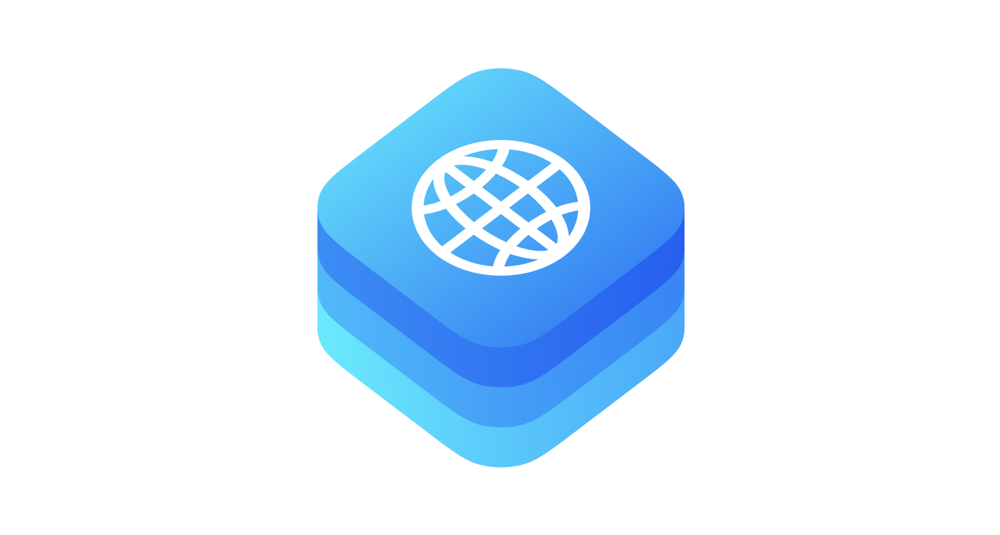

<h1 align="center" style="margin-top: 0px;">Localizable</h1>

<div align = "center">
  <a href="https://cocoapods.org/pods/incetro-localizable">
    
  </a>
  <a href="https://github.com/Incetro/Localizable">
    
  </a>
  <a href="https://github.com/Incetro/incetro-localizable#installation">
    
  </a>
</div>

<div align = "center">
  <a href="https://cocoapods.org/pods/incetro-localizable" target="blank">
    
  </a>
  <a href="https://cocoapods.org/pods/incetro-localizable" target="blank">
    
  </a>
  <br>
  <br>
</div>

An implementation of our vision of dealing with localization and app language changing in a straightforward, scalable and elegant way.

- [Features](#features)
- [Usage](#usage)
- [How it works](#how-it-works)
- [Requirements](#requirements)
- [Communication](#communication)
- [Installation](#installation)
- [Author](#author)
- [License](#license)


## Features
- [x] Manipulate with unlimited languages in your apps
- [x] Get a strict guideline of localizing your views and a unified approach for whole app

## Usage

```swift
// MARK: - Localizable

extension ViewController: Localizable {

    func localize() {
        exampleLabel.text = ...
        changeLanguageButton.setTitle(..., for: .normal)
    }
}

...

/// in the ViewController class
override func viewDidLoad() {
    super.viewDidLoad()
    localizer.add(localizable: self)
}
```

That's it. Every time you need to change a language every localizable observer will be updated.

## How it works

Define your app languages:

```swift

// MARK: - AppLanguage

enum AppLanguage: String {

    case russian = "ru"
    case english = "en"
}

// MARK: - Language

extension AppLanguage: Language {

    static var `default`: AppLanguage {
        russian
    }

    var localizedPath: String {
        Bundle.main.path(forResource: rawValue, ofType: "lproj").unsafelyUnwrapped
    }

    var localeIdentifier: String {
        switch self {
        case .russian:
            return "ru_RU"
        case .english:
            return "en_US"
        }
    }
}
```

Choose a way how you update your app's global appearance. For example:

```swift
override func didSelectCell() {
    localizer.refresh(language: viewModel.language)
    ...
}
```


And all Localizable observers will be re-localized after `localizer.refresh(language:)`. 

You can see more in the [example folder](https://github.com/Incetro/localizable/tree/main/Sandbox/Sandbox)

## Requirements
- iOS 12.1+ / macOS 10.12+ / tvOS 12.1+ / watchOS 3.1+
- Xcode 12.0
- Swift 5

## Communication

- If you **found a bug**, open an issue.
- If you **have a feature request**, open an issue.
- If you **want to contribute**, submit a pull request.

## Installation

### CocoaPods

[CocoaPods](http://cocoapods.org) is a dependency manager for Cocoa projects. You can install it with the following command:

```bash
$ gem install cocoapods
```

To integrate DAO into your Xcode project using CocoaPods, specify it in your `Podfile`:

```ruby
use_frameworks!

target "<Your Target Name>" do
    pod "incetro-localizable"
end
```

Then, run the following command:

```bash
$ pod install
```

### Manually

If you prefer not to use any dependency managers, you can integrate `Localizable` into your project manually.

#### Embedded Framework

- Open up Terminal, `cd` into your top-level project directory, and run the following command "if" your project is not initialized as a git repository:

  ```bash
  $ git init
  ```

- Add `Localizable` as a git [submodule](http://git-scm.com/docs/git-submodule) by running the following command:

  ```bash
  $ git submodule add https://github.com/Incetro/localizable.git
  ```

- Open the new `Localizable` folder, and drag the `Localizable.xcodeproj` into the Project Navigator of your application's Xcode project.

    > It should appear nested underneath your application's blue project icon. Whether it is above or below all the other Xcode groups does not matter.

- Select the `Localizable.xcodeproj` in the Project Navigator and verify the deployment target matches that of your application target.
- Next, select your application project in the Project Navigator (blue project icon) to navigate to the target configuration window and select the application target under the "Targets" heading in the sidebar.
- In the tab bar at the top of that window, open the "General" panel.
- Click on the `+` button under the "Embedded Binaries" section.
- You will see two different `Localizable.xcodeproj` folders each with two different versions of the `Localizable.framework` nested inside a `Products` folder.

    > It does not matter which `Products` folder you choose from, but it does matter whether you choose the top or bottom `Localizable.framework`.

- Select the top `Localizable.framework` for iOS and the bottom one for OS X.

    > You can verify which one you selected by inspecting the build log for your project. The build target for `Localizable` will be listed as either `Localizable iOS`, `Localizable macOS`, `Localizable tvOS` or `Localizable watchOS`.

- And that's it!

  > The `Localizable.framework` is automagically added as a target dependency, linked framework and embedded framework in a copy files build phase which is all you need to build on the simulator and a device.
  
## Author

incetro, incetro@ya.ru

## License

DAO is available under the MIT license. See the LICENSE file for more info.
